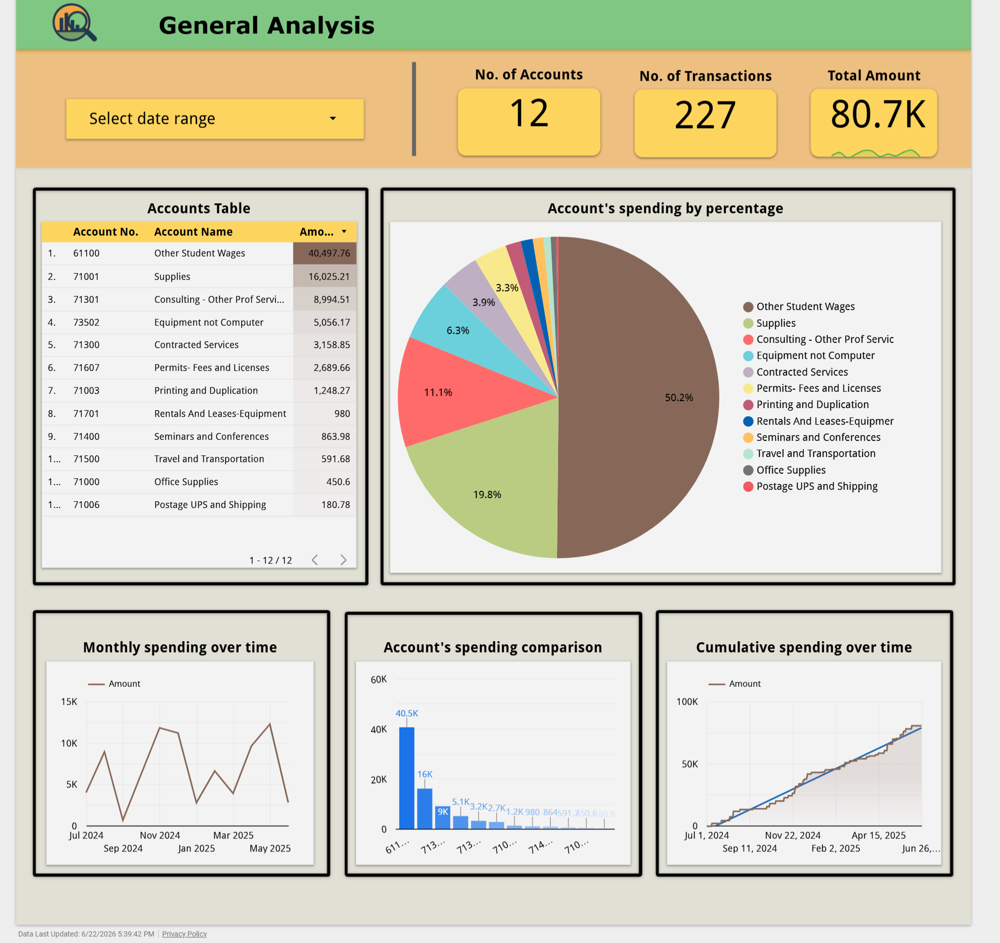
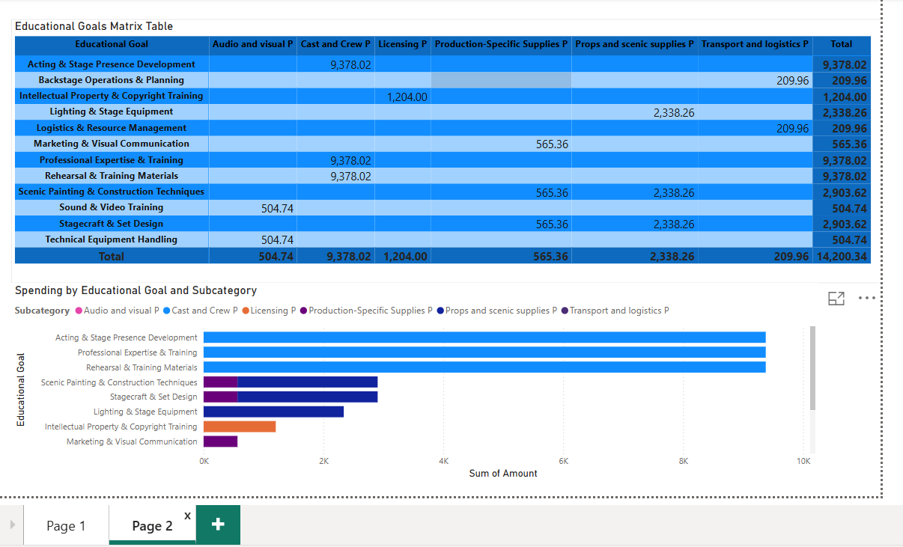

# University Department Budget & Performance Analytics Dashboard

## Project Overview

Developed a series of business intelligence dashboards to support financial planning, budget monitoring, resource allocation, and performance reporting for a university department.

The project consolidated financial and operational data into executive-level dashboards that improved visibility into budget utilization, strategic objectives, and project-level performance.

---

## Business Problem

University departments manage multiple budgets, projects, and strategic initiatives simultaneously.

Decision-makers require timely visibility into:

- Budget allocations
- Spending performance
- Strategic goal achievement
- Project-level financial performance
- Resource utilization

Traditional reporting methods made it difficult to monitor performance across multiple initiatives efficiently.

---

## Solution

Designed and developed interactive dashboards that provided:

- Department-wide budget visibility
- Budget allocation analysis
- Strategic goal tracking
- Project-level financial monitoring
- Executive KPI reporting

The dashboards enabled stakeholders to evaluate financial performance and support data-driven planning decisions.

---

## Dashboard Types

### Executive Budget Dashboard

Provides a consolidated view of:

- Budget allocations
- Expenditures
- Remaining balances
- Department-level KPIs

### Strategic Goals Dashboard

Tracks:

- Budget alignment with educational objectives
- Performance indicators
- Goal achievement progress

### Project Performance Dashboard

Monitors:

- Individual project budgets
- Spending trends
- Project performance metrics
- Resource allocation

---

## Skills Demonstrated

- Business Intelligence
- Financial Analytics
- Budget Analysis
- KPI Development
- Executive Reporting
- Data Visualization
- Dashboard Design
- Decision Support Analytics

---

## Tools Used

- Power BI
- Looker Studio
- Microsoft Excel

---

## Business Impact

The dashboards improved financial transparency and provided stakeholders with a centralized view of budget performance, strategic initiatives, and project-level analytics.

---

## Dashboard Screenshots

### Executive Budget Dashboard

### Project Performance Dashboard

### Strategic Goals Dashboard

